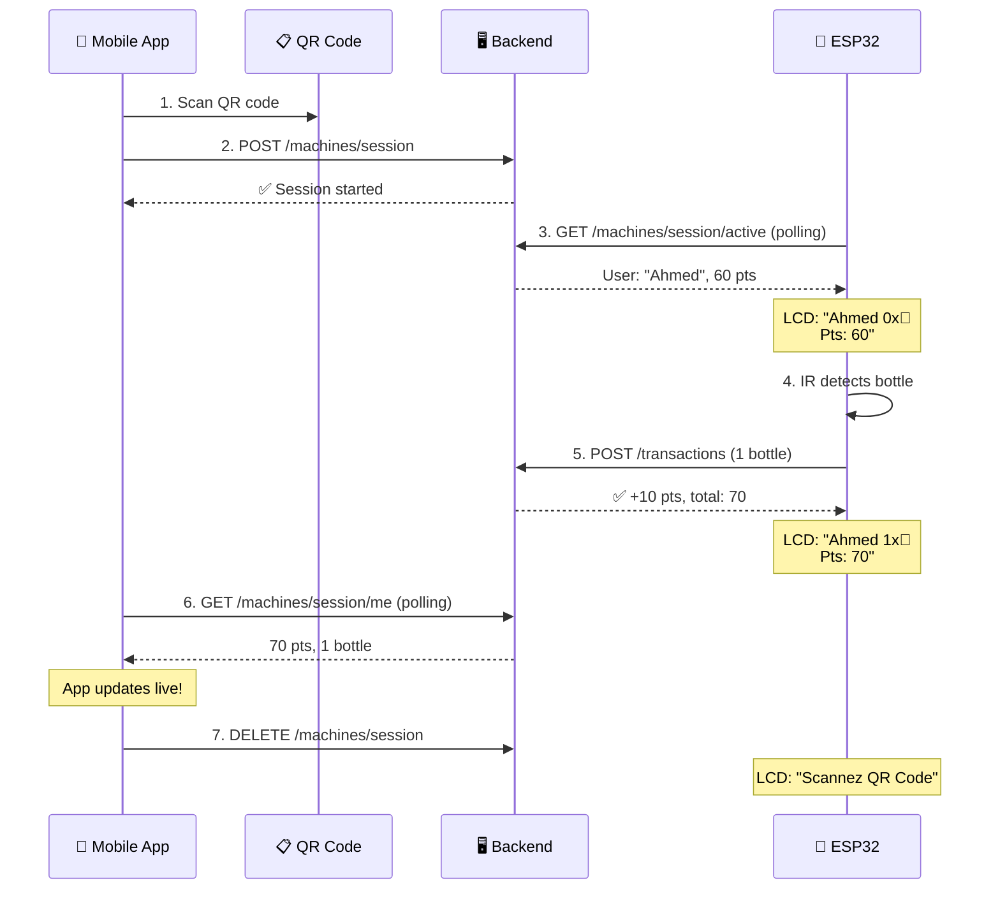

# ESP32 Bottle Collection Machine — Walkthrough

## Summary

Implemented the full ESP32 integration for the PlastiPay recycling system. Users scan a QR code with the mobile app to connect to a machine, the ESP32 detects bottles via IR sensor and sends transactions to the backend, and points update in real-time on both the LCD display and the mobile app.

## Files Changed

### Backend (3 new/modified files)

| File | Change |
|------|--------|
| [session.store.js](file:///c:/Users/R%20I%20B/OneDrive/Desktop/ons/src/config/session.store.js) | **NEW** — In-memory session store (Map) linking users ↔ machines |
| [machine.controller.js](file:///c:/Users/R%20I%20B/OneDrive/Desktop/ons/src/controllers/machine.controller.js) | **MODIFIED** — Added `startSession`, `getActiveSession`, `endSession`, `getMySession` |
| [machine.routes.js](file:///c:/Users/R%20I%20B/OneDrive/Desktop/ons/src/routes/machine.routes.js) | **MODIFIED** — Added 4 session routes |
| [transaction.controller.js](file:///c:/Users/R%20I%20B/OneDrive/Desktop/ons/src/controllers/transaction.controller.js) | **MODIFIED** — Updates session store after each transaction |

### ESP32 Arduino (1 new file)

| File | Change |
|------|--------|
| [plastipay_esp32.ino](file:///c:/Users/R%20I%20B/OneDrive/Desktop/ons/esp32/plastipay_esp32/plastipay_esp32.ino) | **NEW** — Complete Arduino sketch for ESP32-S3 |

### Flutter App (4 modified files)

| File | Change |
|------|--------|
| [pubspec.yaml](file:///c:/Users/R%20I%20B/OneDrive/Desktop/ons/plastipay_app/pubspec.yaml) | **MODIFIED** — Added `mobile_scanner: ^6.0.0` |
| [api_service.dart](file:///c:/Users/R%20I%20B/OneDrive/Desktop/ons/plastipay_app/lib/services/api_service.dart) | **MODIFIED** — Added `startMachineSession`, `getMySession`, `endMachineSession` |
| [scan_screen.dart](file:///c:/Users/R%20I%20B/OneDrive/Desktop/ons/plastipay_app/lib/screens/scan_screen.dart) | **NEW** — QR scanner + live session screen |
| [home_screen.dart](file:///c:/Users/R%20I%20B/OneDrive/Desktop/ons/plastipay_app/lib/screens/home_screen.dart) | **MODIFIED** — Added "Scanner une Machine" button |

---

## ESP32 Hardware Wiring

```
ESP32-S3 WROOM-1          LCD I2C 2x16 (Blue)
═══════════════            ═══════════════════
GPIO 8 (SDA)  ──────────── SDA
GPIO 9 (SCL)  ──────────── SCL
5V            ──────────── VCC
GND           ──────────── GND

ESP32-S3 WROOM-1          KY-032 IR Sensor
═══════════════            ═══════════════════
GPIO 4        ──────────── OUT
3.3V          ──────────── VCC (or +)
GND           ──────────── GND
```

## ESP32 Configuration

> [!IMPORTANT]
> Before flashing, edit these values in [plastipay_esp32.ino](file:///c:/Users/R%20I%20B/OneDrive/Desktop/ons/esp32/plastipay_esp32/plastipay_esp32.ino):

```cpp
const char* WIFI_SSID     = "YOUR_WIFI_SSID";           // ← Your WiFi name
const char* WIFI_PASSWORD = "YOUR_WIFI_PASSWORD";        // ← Your WiFi password
const char* SERVER_URL    = "http://192.168.1.100:3000"; // ← Your PC's local IP
const char* MACHINE_API_KEY = "machine_key_001_secret";  // ← Machine API key from DB
```

**To find your PC IP:** run `ipconfig` in terminal, look for `IPv4 Address` under your WiFi adapter.

### Arduino IDE Setup
1. Install **ESP32 board package** in Arduino IDE (Board Manager → search "ESP32")
2. Select board: **ESP32S3 Dev Module**
3. Install libraries via Library Manager:
   - `LiquidCrystal_I2C` by Frank de Brabander
   - `ArduinoJson` by Benoit Blanchon (v7+)
4. Connect ESP32 via USB-C, select port, flash

---

## QR Code Generation

> [!IMPORTANT]
> Each machine needs a QR code printed with this content format:

```
plastipay://connect?machine=ECO-TN-001
```

Replace `ECO-TN-001` with the machine's serial number. Generate QR codes at:
- https://www.qr-code-generator.com/
- Or any free QR generator — just paste the text above

---

## New API Endpoints

| Method | Endpoint | Auth | Description |
|--------|----------|------|-------------|
| `POST` | `/api/machines/session` | JWT (user) | Start session after QR scan |
| `GET` | `/api/machines/session/active` | Machine API key | ESP32 polls for active session |
| `GET` | `/api/machines/session/me` | JWT (user) | Mobile app polls session status |
| `DELETE` | `/api/machines/session` | JWT (user) | End session |

---

## How It Works


